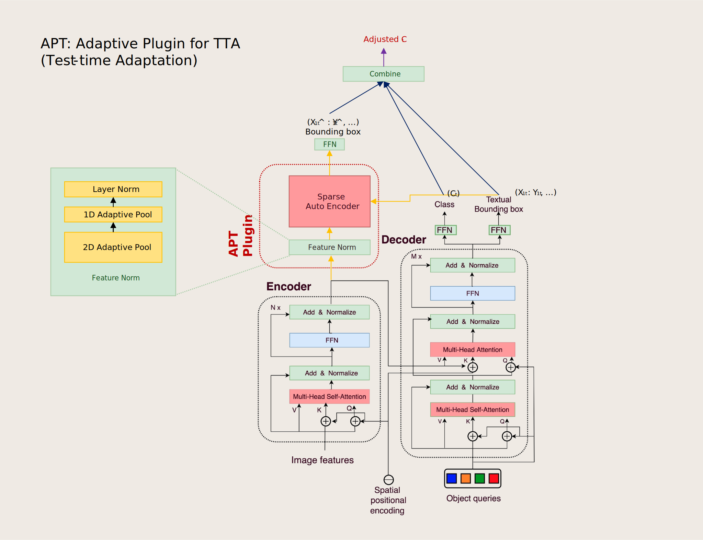

# test-time-adapters
A Ready-to-Go Playground for Test-time Learning Methods

> Ensures to be easily integrated with vision libraries such as detectron2, ultralytics, transformers.


## Academic History
- [1980s~1990s] Continual Learning

  Continual Learning, also known as Lifelong Learning, was conceptualized as early as the late 1980s, with significant foundational work in the early 1990s. This field addresses the challenge of training a model on a continuous stream of data from different tasks without forgetting previously learned knowledge. The primary goal is to achieve **forward transfer** (leveraging past knowledge to learn new tasks more efficiently) and prevent **catastrophic forgetting** (a sudden drop in performance on previous tasks after learning a new one). Early work focused on neural networks' ability to learn sequentially, a problem that remains a central focus of the field today.

- [1990s] Domain Adaptation

  The concept of Domain Adaptation emerged in the mid-1990s within the machine learning community. It deals with a scenario where a model is trained on a labeled source domain but is expected to perform well on a different, yet related, target domain where labeled data is scarce or unavailable. The core challenge is the **domain shift** or **distributional shift** between the source and target data. The primary objective is to leverage the knowledge from the source domain to build a robust model for the target domain.

- [2000s] Unsupervised Domain Adaptation

  Building upon domain adaptation, Unsupervised Domain Adaptation (UDA) became a distinct and active area of research around the mid-2000s. In the classic UDA setting, the model has access to labeled data from the source domain and **unlabeled** data from the target domain during the training phase. The goal remains the same: to overcome the domain shift. UDA methods often work by trying to align the feature distributions of the source and target domains, making them indistinguishable to the model.

- [2010s] Domain Regularization

  While the general idea of regularization to prevent overfitting is decades old, its specific application to domain-related problems, or Domain Regularization, gained prominence in the early 2010s. This approach involves adding specific regularization terms to the model's objective function during training. These terms are designed to encourage the model **to learn features that are invariant across different domains** (e.g., source and target domains). By penalizing domain-specific features, the model is forced to focus on more general, underlying patterns, thereby improving its ability to generalize to new, unseen domains.

- [2019] Source-Free Domain Adaptation

  A more recent development, Source-Free Domain Adaptation (SFDA), was formally introduced around 2019. This subfield addresses a more challenging and practical scenario where the adaptation to the target domain must be performed **without access to the source data**. The process typically involves taking a pre-trained source model and adapting it using only unlabeled target data. This is particularly useful in situations where the source data is private, proprietary, or too large to transfer.

- [2020] Test-time Adaptation (Online)

  Test-Time Adaptation (TTA), sometimes referred to as Online Adaptation, emerged as a distinct concept around 2020. TTA aims to adapt a pre-trained source model to a target domain "on the fly" during the testing phase. The model updates itself using each incoming batch of test data. Unlike traditional domain adaptation, TTA is typically **source-free** and **online**, meaning it adapts continuously as it encounters new data from the target distribution. The adaptation is often done by updating specific parts of the model, like batch normalization statistics, or by minimizing an unsupervised objective function on the test data.

- [2022] Continual Test-time Adaptation

  The most recent field on this list, Continual Test-Time Adaptation (CTTA), was proposed around 2022. It extends Test-Time Adaptation to a more realistic scenario where the target domain is not static but changes over time. Therefore, the model must **continuously adapt** to a stream of data from non-stationary, ever-changing target distributions. A key challenge in CTTA is to adapt to the current data distribution while avoiding overfitting to transient changes and forgetting what it has learned from previous target distributions.


## Methods
- [x] Batch Statistics Replacement
  - [x] Covariate Shift Adaptation (NORM)
  - [x] Dynamic BN Adaptation (DUA)
- [ ] Entropy Minimization
  - [ ] BatchNorm Entropy Minimization (TENT)
  - [ ] Sample-Efficient Entropy Minimization (EATA)
  - [ ] Marginal Entropy Minimization (MEMO, Sample Data Augmentation)
- [ ] Auxiliary Task
  - [ ] Rotation Prediction (TTT, Self-Supervised)
  - [ ] Contrastive Learning (TTT++, Self-Supervised)
  - [ ] Masked Pixel Prediction (Masked TTT, Self-Supervised)
- [ ] Consistency Regularization
  - [x] Temporal EMA (Mean-Teacher, Self-Training/Semi-Supervised)
  - [ ] Teacher-Student Augmentation Consistency (TeST, Self-Training/Semi-Supervised)
  - [x] Temporal Consistency Regularization (APT, Self-Supervised)
- [x] Sample Selection
  - [x] Active Learning (ActMAD)
  - [ ] De-biasing (DeYO)
- [ ] Parameter-Efficient Adaptation
  - [x] Low-Rank Adaptation (WHW / When, Where, and How to Adapt?)
  - [ ] Sensitivity-Guided Pruning (SGP)

### APT: Adaptive Plugin for Test-time Adaptation via Temporal Dependency under Continual Domain Shift
Pluggable Test-time Adapter Implementations

> This suggests a pluggable implementation of Test-Time Adaptation module (APT).

> It is designed to be easily integrated into existing Transformer-family models (but not limited to), enhancing their capabilities to adapt during inference time under the distribution shift.


### Performance Metrics
| Method | Dataset | Metric      | Value |
|--------|---------|-------------|------|
| APT    | SHIFT   | mAP (50-95) | ???  |


## Datasets


## Usage
> [!NOTE]
> Detectron2 requires to be built in your device since meta does not provide pre-built wheel for recent PyTorch versions.
> Sometimes, you may encounter an error related to CUDA version mismatch cause uv/pip will choose the system-default CUDA toolkit version.
> In such cases, you can try the following steps to set the correct CUDA toolkit version in linux:
```bash
# Check current CUDA symlink
ls -la /usr/local/cuda

# Set target CUDA version
export CUDA_HOME=/usr/local/cuda-12.8
export PATH=/usr/local/cuda-12.8/bin:$PATH
export LD_LIBRARY_PATH=/usr/local/cuda-12.8/lib64:$LD_LIBRARY_PATH

# Rebuild
uv sync --extra torch
```

### Installation (Use this repository as a package for your own project)
```bash
uv add torch torchvision  # install torch manually
uv add git+https://github.com/robustaim/test-time-adapters.git
```

### Reproduction of Results
#### Environment Setup
```bash
git clone https://github.com/robustaim/test-time-adapters.git ptta
cd ptta
uv sync --extra torch-cu128  # only windows
uv sync --extra torch  # only linux
```

#### Run Batch Experiments
```bash
python example.py
```

#### Apply to Your Own Model
```python
from ttadapters.methods import APTConfig, AdaptationPlugin
```


## Citation
```
@InProceedings{shift2022,
    author    = {Sun, Tao and Segu, Mattia and Postels, Janis and Wang, Yuxuan and Van Gool, Luc and Schiele, Bernt and Tombari, Federico and Yu, Fisher},
    title     = {{SHIFT:} A Synthetic Driving Dataset for Continuous Multi-Task Domain Adaptation},
    booktitle = {Proceedings of the IEEE/CVF Conference on Computer Vision and Pattern Recognition (CVPR)},
    month     = {June},
    year      = {2022},
    pages     = {21371-21382}
}
```
```
@misc{lv2023detrs,
      title={DETRs Beat YOLOs on Real-time Object Detection},
      author={Yian Zhao and Wenyu Lv and Shangliang Xu and Jinman Wei and Guanzhong Wang and Qingqing Dang and Yi Liu and Jie Chen},
      year={2023},
      eprint={2304.08069},
      archivePrefix={arXiv},
      primaryClass={cs.CV}
}
```
```
@inproceedings{wolf-etal-2020-transformers,
    title = "Transformers: State-of-the-Art Natural Language Processing",
    author = "Thomas Wolf and Lysandre Debut and Victor Sanh and Julien Chaumond and Clement Delangue and Anthony Moi and Pierric Cistac and Tim Rault and Rémi Louf and Morgan Funtowicz and Joe Davison and Sam Shleifer and Patrick von Platen and Clara Ma and Yacine Jernite and Julien Plu and Canwen Xu and Teven Le Scao and Sylvain Gugger and Mariama Drame and Quentin Lhoest and Alexander M. Rush",
    booktitle = "Proceedings of the 2020 Conference on Empirical Methods in Natural Language Processing: System Demonstrations",
    month = oct,
    year = "2020",
    address = "Online",
    publisher = "Association for Computational Linguistics",
    url = "https://www.aclweb.org/anthology/2020.emnlp-demos.6",
    pages = "38--45"
}
```
